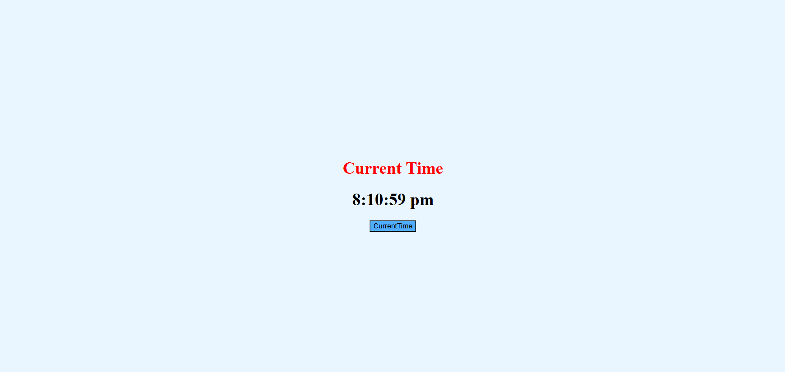

# ⏰ Time Change – Live Clock React App

🌐 **Live Demo:** [https://time-change.vercel.app/](https://time-change.vercel.app/)

## 🚀 About the Application

**Time Change** is a clean and simple React web app that displays the current time and updates instantly when the user clicks a button. It is designed with a light UI, smooth experience, and beginner‑friendly React concepts.

## ✨ Key Features 

✅ Displays real‑time current system time
✅ Updates instantly on button click
✅ Built using React Hooks (`useState`)
✅ Clean light‑color UI for easy reading
✅ Deployed live on Vercel for fast performance

## 📸 Live Output Preview

## 🛠 Tech Stack

* React.js
* JavaScript (ES6)
* CSS3
* Vercel (Deployment)

## 📸 What the App Does

• Shows current time in large readable format
• Button refreshes time instantly
• Perfect beginner React mini‑project

## 🎯 Why This Project Is Useful

This project helps beginners learn:

✔ React components
✔ State management with hooks
✔ Event handling
✔ UI alignment and styling
✔ Real‑world deployment

--

### ⭐ If you like this project, feel free to star it and share!

Happy Coding 🚀
